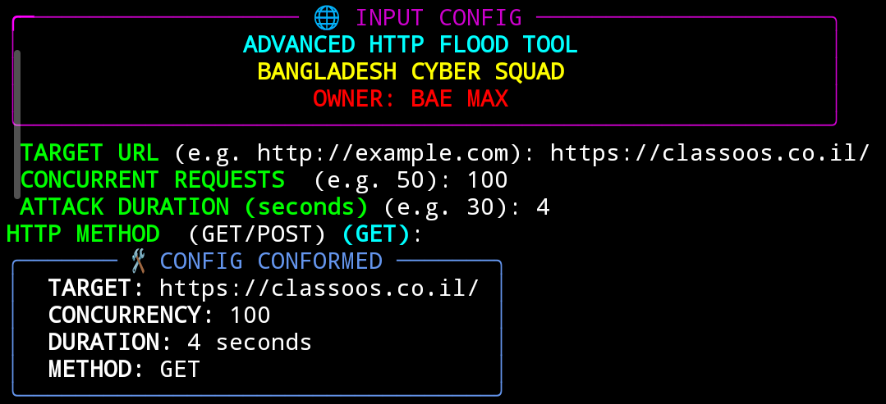

# 🛡️ BDOS - Asynchronous HTTP Flood Tool


> **Author**: [JOY-XII](https://github.com/JOY-XII)  
> **Tool Name**: `Bdos.py`  
> **Purpose**: A high-speed, asynchronous GET/POST HTTP flooder for educational and authorized stress testing.

---

## ⚙️ Features

- 🚀 Blazing-fast attacks using `asyncio` and `aiohttp`
- 🗡️ Continuous `Attacking 🗡️` feedback while active
- 🌐 Supports both `GET` and `POST` methods
- 🎨 Styled user interface using `Rich`
- 🧠 Randomized headers and query parameters
- 📱 Works on **Linux**, **Windows**, **Termux** (no root required)

---

## 📦 Requirements

Create a `requirements.txt` file:

```txt
aiohttp
rich
```

Install dependencies:

```bash
pip install -r requirements.txt
```

---

## 💻 Usage

```bash
git clone https://github.com/JOY-XII/Bdos.py.git
cd Bdos.py
python Bdos.py
```

You will be prompted to enter:

- 🌐 Target URL (e.g. http://example.com)
- 🔁 Concurrent Requests (e.g. 100)
- ⏱️ Duration (e.g. 30 seconds)
- 📮 Method: GET or POST

---

## 🧪 Example

```bash
Target URL: http://test.com
Concurrent Requests: 100
Attack Duration: 30 seconds
HTTP Method: GET
```

---

## 📺 Sample Output

```
Attacking 🗡️
Attacking 🗡️
Attacking 🗡️
Attacking 🗡️
...
```

> ✅ Printed continuously during the attack window you specified.

---

## 🖼️ Preview



---

## 📁 Project Structure

```
Bdos.py
README.md
requirements.txt
assets/
 └── demo.gif
```

---

## ⚖️ Legal Disclaimer

> 🛑 **This tool is for educational and authorized testing only.**  
> ❌ Do NOT use it on websites, servers, or services without full legal permission.  
> 🧑‍⚖️ Unauthorized usage may violate laws and could lead to prosecution.

---

## 🤝 Contributing

- Fork the repo, create your branch, and submit a pull request.
- Issues and feature requests are welcome.

---

## 📫 Contact

- GitHub: [JOY-XII](https://github.com/JOY-XII)

---

⭐ **If you like this tool, give it a star!**
